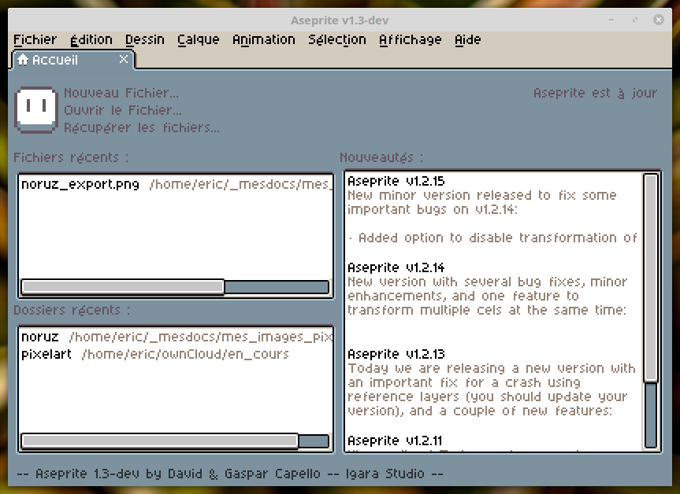

## Aseprite en français 

Je travaille sur une traduction de [aseprite](https://github.com/aseprite/aseprite) en français !

Merci de contribuer à ce travail pour le terminer plus rapidement !

Pour l'installer, télécharger le .zip situé à https://github.com/farvardin/aseprite_french/releases, ouvrez aseprite, allez dans preferences>extensions, ajoutez l'extention zippée précédemment téléchargée, appuyez sur "apply", allez dans preferences>general et choisissez la langue "fr" (redémarrage d'Aseprite peut-être nécessaire pour prendre en compte tous les changements).

## Aseprite in French 

I'm working on a translation of [aseprite](https://github.com/aseprite/aseprite) to French!

Please contribute to speed it up!

To install it, download the .zip in https://github.com/farvardin/aseprite_french/releases, open aseprite, go to preferences>extensions, add the zipped extension, apply, go to preferences>general and choose the "fr" language (restarting aseprite might be necessary in order to take all changes into account). 

